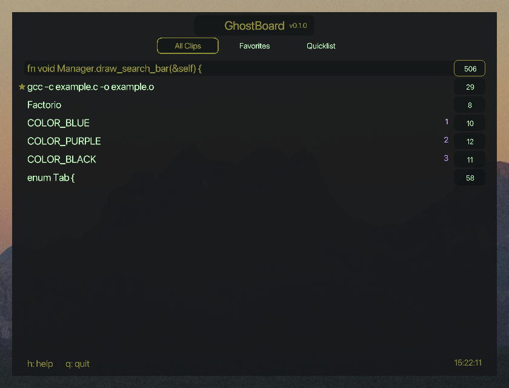
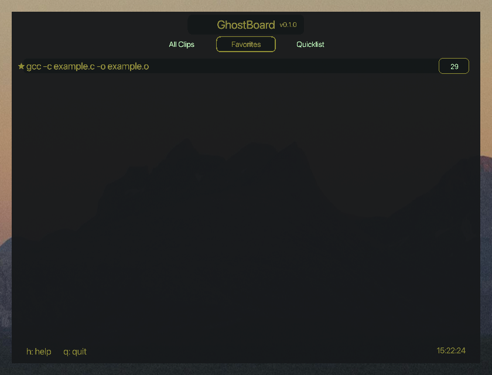
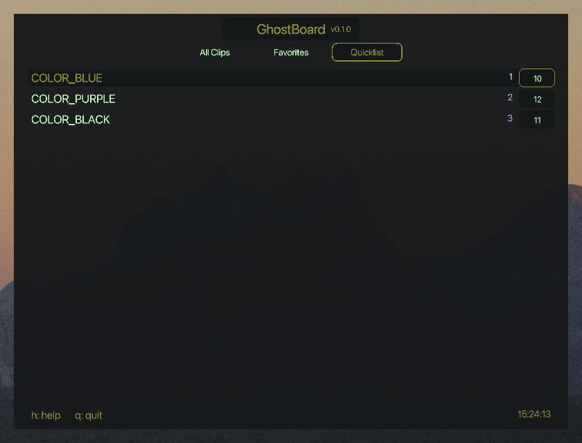
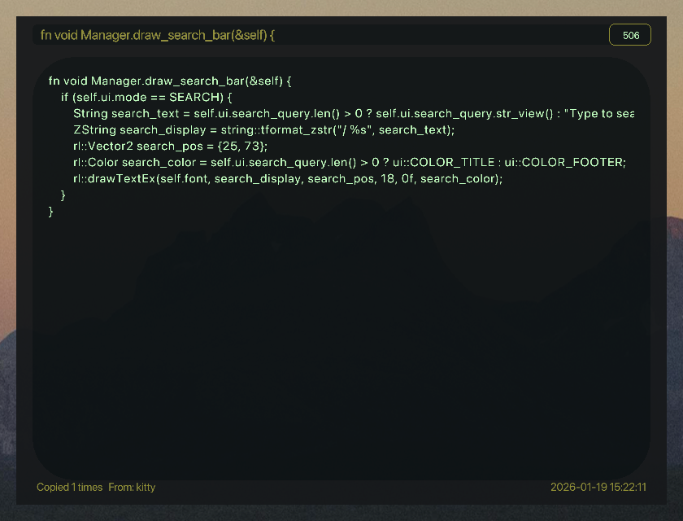
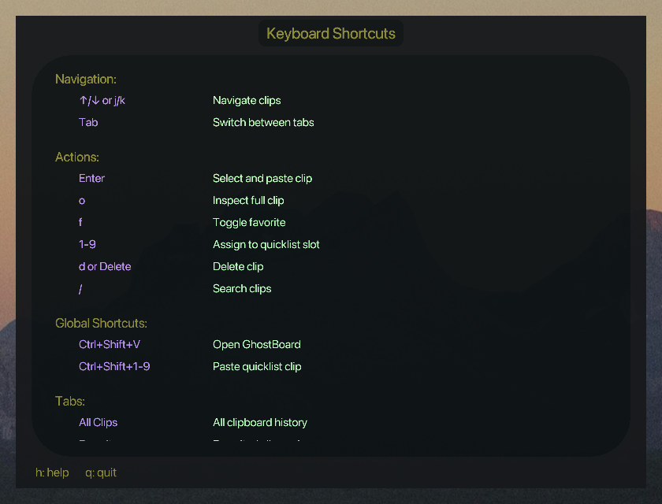

# GhostBoard

Clipboard manager for macOS.

## Keyboard Shortcuts

### Global Shortcuts (work anywhere)
| Key | Action |
|-----|--------|
| `Ctrl+Shift+V` | Open GhostBoard |
| `Ctrl+Shift+1-9` | Paste quicklist clip (slots 1-9) |

### Navigation
| Key | Action |
|-----|--------|
| `↑/↓` or `j/k` | Navigate clips |
| `Ctrl+d` | Page down (jump 8 items) |
| `Ctrl+u` | Page up (jump 8 items) |
| `Tab` | Switch between tabs (All Clips → Favorites → Quicklist) |
| `h` | Toggle help page |
| `q` or `Esc` | Quit/Close window |

### Actions
| Key | Action |
|-----|--------|
| `Enter` | Select and paste clip |
| `o` or `i` | Inspect full clip (scrollable view) |
| `f` | Toggle favorite |
| `1-9` | Assign/unassign quicklist slot |
| `dd` | Delete clip (double-tap d) |
| `Delete` | Delete clip immediately |
| `/` | Search clips |

### Tabs
- **All Clips**: Complete clipboard history (sorted by usage)
- **Favorites**: Clips marked with `f`
- **Quicklist**: Clips assigned to slots 1-9 for quick access

## Screenshots

### Show all clips
Its sorted by usage, most used is on top.

### Show your starred clips
Star a clip with 'f' for favorite

### Show quicklist
Assign ctrl-shift-1 through 9 by hittin 1 through 9 on a clip.

### Open the clip for inspection
Some clips are long, open a scrollable view to see the whole ting.

### Open the help page

## Feature ideas

- [x] search/filter clips - press / to search through history by text content
- [x] pin/favorite clips - mark important clips and keep them in a tab
- [x] sessions/tabs - multiple tabs for All Clips, Favorites, and Quicklist
- [x] keymap for paste without showing menu: ctrl-shift-1 through 9
- [x] duplicate detection - merge identical entries and track hit count
- [x] export/import history - binary storage format
- [x] help page - press h to see keyboard shortcuts
- [x] source app tracking - shows which app the clip was copied from
- [ ] clipboard categories/tags - auto-detect urls, code snippets, images, etc and show icons/badges
- [ ] rich text/image preview - show formatted text or thumbnails
- [ ] configurable hotkey - let user change ctrl-shift-v in settings
- [ ] dark/light theme toggle
- [ ] clipboard templates - save frequently used text snippets
- [ ] statistics - show most copied items, usage patterns
- [ ] window resize
- [ ] smart duplicate handling
    - show "previously copied x times"
    - group duplicates and show last N unique clips
    - "pin to top" frequently used clips
- [ ] clip expiration/auto-cleanup non-fav clips older than x days
- [ ] quick filter
    - ctrl-shift-c show only clips from current app
    - ctrl-shift-t show only todays clips
    - ctrl-shift-w show only this weeks clips
- [ ] 'n' to add notes to a selected clip, small colored label next to the clip. search include notes
- [ ] shift-v plus j/k to select range, then d or enter to action
- [ ] paste with line numbers
- [ ] fuzzy search (only substring search now)
- [ ] export selected clips

