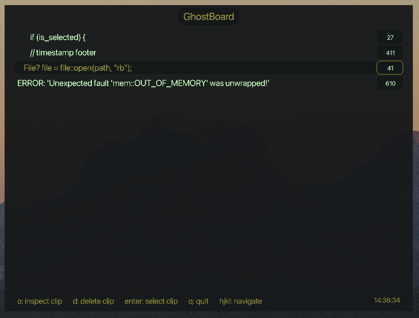
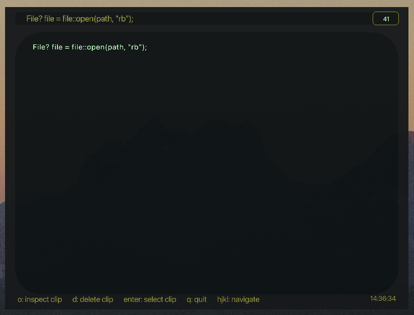

# GhostBoard

Clipboard manager for macOS.

Clips:

Inspect clip:

# TODO

[x] search/filter clips - pres / to search through history by text content
[ ] pin/favorite clips - mark important clips and keep them at the top/tab
[ ] sessions/tabs
[ ] keymap for paste without showing menu: ctrl-shift-1 through 9
[ ] clipboard categories/tags - auto-detect urls, code snippets, images, etc and show icons/badges
[ ] rich text/image preview - show formatted text or thumbnails
[x] duplicate detection - merge identical entries
[x] export/import history
[ ] configurable hotkey - let use change ctrl-shift-v in settings
[ ] dark/light theme toggle
[ ] clipboard templates - save frequently used text snippets
[ ] statistics - show most copied items, usage patterns
[ ] custom fonts
[ ] window resize
